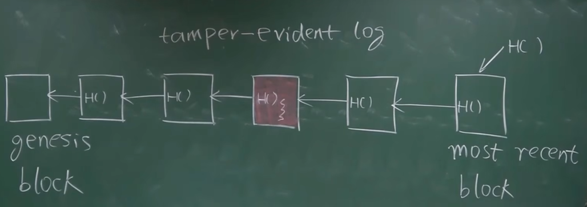
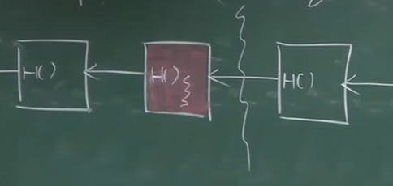
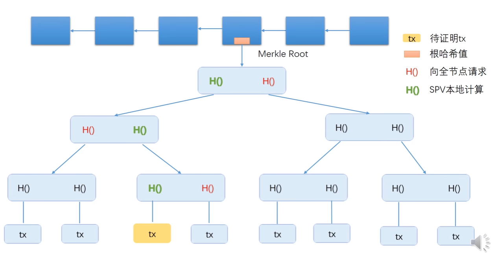
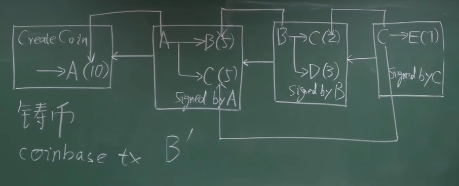

## 密码学原理：

## 1、Hash

crypto-currency(加密货币)、哈希

哈希碰撞--->   x=y  -> H(x) ≠H(y)

## 2、Hiding

x->H(x)  但是H(x) -\\->x       不可逆            通常x后加一个随机数取hash   H(x||nonce)

x输入空间足够大，分布均匀

digital equipment of a sealed  envelope

## 3、puzzle friendly

H(block header) <= target

##### 比特币的hash函数:

SHA-256  (Secure Hash Algorithm)

##### 比特币开户：公私钥(非对称加密)  

 公钥加密，私钥解密     都是接收方的，公钥给别人，私钥自己留着解密

## 数据结构：

### 哈希指针

哈希链表是根据每个区块合一起取的哈希

如果红色部分的块被改，那么其他的都会改，后面的都会改，所以只需要保存最后一个结点即可知道其他区块是否改变。

如果接受外来区块，如红色的，查看与该节点相连的区块保存的hash值是否和红块一致

### Merkle Tree

绿色的哈希值和红色的哈希值相结合，依次得出向上，所以只需要看根节点的

因为哈希碰撞原理，全节点的篡改几乎不可能

证明包含某个交易的时间复杂度:log(n)

证明不包含的，最快需要排序时间复杂度加log(n)

## 比特币协议

交易示意图

### 块头和块体

#### block header包含的大多为宏观信息

比特币协议

指向前一块的指针

merkle tree的根哈希值

挖矿的目标阈值target

随机数nonce

#### block body

交易列表

### 全结点-轻结点

full node   -----fully validating node     保存所有信息，验证信息

light node -----只保存block header信息

### distributed consensus(分布式共识)

#### FLP impossiblity result    

asynchronous 网络传输过程中，时延没有上线。即使一个成员faulty(有问题)，也不能达成共识。

#### CAP Theorem

CAP------(consistency)  (availablity)  (partition tolerance)一致性   可用性    分区容错性，三者最多可取两个，无法同时满足

### Consensus in Bitcoin

 女巫攻击：产生超过半数的结点进行投票

##### 最长合法链

例如A->A` 插入到该链中，来回滚之前的事物，被称为分叉攻击。

当两个矿工同时产生一个区块(获得记账权)，等长情况会维持一段时间，直到谁先再拓展一个区块为胜出。

根据算力来进行投票

## 比特币实现

### transaction-based ledger

UTXO----Unspent Transaction Output			未花掉的交易

区块链中维护UTXO可以检测双花，快速交易

例如：A给B了5个，B花了，B的输出就不在有UTXO。C不花就在。B输出给了别人，就会产生新的UTXO	

每个交易有多个输入和输出，但是所有的输入金额等于所有的输出金额。

在交易过程中会有交易费，用于奖励初块

### account-based ledger

上图中H计算不包含tx(交易)，只包含块头

挖矿时间与过去挖了多次时间没关系，概率一直是一样的

比特币总量

对于M，如果M给A后，再次发布一个给自己的，造成双花攻击。此时需要M->A后续继续确认，因为大部分的节点都是善良的结点。

##  比特币网络

tcp

底层为P2P网络，对等的，无主结点和超级结点，只有种子结点

设计原则：简单，鲁棒

比特币网络传播：besteffort

## 挖矿

挖矿难度和目标阈值成反比、

如果挖矿难度低，会产生大量的分叉，恶意结点可进行对其攻击

目标阈值调整公式：actual time为前一个区块产生实际时间，ecpected time 为预期的(2016*10 / 60*24)=14天

挖矿难度，与上方目标阈值成反比

挖矿设备的变化：CPU-----GPU-----ASIC

大型矿石的出现，矿主按照每个旷工的工作量分配区块

## 比特币脚本

confirmations交易确认数

time为该交易产生的时间，blocktime为这个区块产生的时间			两则为某个时间点到现在的时间

txid表示之前交易的hash值，从这个交易来的

n为序号，表示这个交易中的第几个输出

asm表示输出脚本内容

reqSigs表示需要多少个签名

type为输出类型

address为输出的地址

B->C时，需要坚持B的来源，将A->B的输出脚本和B->C的输入脚本拼接在一起。后处于安全的考虑，各自执行

使用公钥检测是否合法

DUP把栈顶复制一遍压入栈，

HASH160是把栈顶的元素取HASH再压入栈

PUSHDATA(PubKeyHash)为输出脚本的，就是要交易给谁

EQUALVERIFY弹出栈顶的两个元素是否相等，防止冒名顶替

该方式采用收款人提供的脚本Hash(redeemScriptHash)代替了收款人公钥hash

 

此次验证中只要有三个即可。例：电商当中5个交易只需要验证3个，有的验证4个，不同电商规则不同，用户则面临复杂性。所以提出下面规则：

将输出脚本转移到输入脚本，简化输入脚本

第一阶段验证：

第二阶段验证：

## 分叉

deliberate fork当意见不一致产生的分叉

protocol fork 不同意协议的修改

根据协议的不同可分为硬分叉和软分叉

#### 硬分叉：区块大小限制

节点从1m到2m 

有大容量节点和小容量节点

B->C后，C->B之后，下链回放C->B,这样B就白套了一个C的钱。

ETH和ETC解决的方法是加chainID

##### 软分叉：加一些限制，导致原本合法的区块在新的区块里面不合法

可能会导致挖的和之前一样的大区块不被接受，导致白挖

#####  P2SH:Pay to Script  Hash

## 课堂问答

#### 发生交易时，接收则不在线？

转账交易只是在区块链中记录一下，是否在线无影响。

#### 假设某个全节点，接收了一个转账交易，接收则的地址是这个节点之前没有出现的？

是可能的，创建比特币区块的时候不需要告诉别人，第一次交易时别人才知道该节点存在

#### 账户的私钥丢失？

账户的钱变成了死钱，

#### 账户私钥泄露？

尽快转移资产

#### 转账写错了地址？转给了别的人

没办法取消，认栽。如果知道对方地址，联系对方。如果没地址，认栽 

#### 挖到的矿答案被偷

 不可能发生偷答案，因为每个矿工挖到的nonce和自己的收款地址绑定在一起的

##### 交易费该给那个矿工？

事先不需要知道那个矿工，

## 比特币的匿名性

比特币中的匿名大致为伪命

 网络匿名方法：例如TOR，经过很多次转发，每个节点只知道前一个节点

应用层匿名方法：混币

### 零知识证明

#### 盲签

## 比特币思考

### HASH指针

##### 在网络中指针怎么传播？

在传播中实际上只有HASH，没有指针

### 区块恋

截断私钥，各自拿一段。但是有风险，透露一段，那么剩下的可能会被破解。所以可以使用多重签名。

#### 分布式共识

理论上不可能达到共识，但为什么比特币系统能够绕过分布式共识中的那些不可能言论？

其他操作，如服务器挂了，叫人去检测

#### 比特币的稀缺性

#### 量子计算

# 以太坊

比特币出块时间太长，导致挖矿设备专业化

以太坊出块时间为十几秒，采用ghost协议，要求内存高为了防止asic芯片

比特币的mining puzzle为算力求取hash值，工作量证明

而比特币的mining puzzle的为权益证明

proof  of work ——》proof  of  stake

以太坊采用智能合约协议

比特币：去中心化货币

以太坊：去中心化合约

## 以太坊账户

比特币转账时，如果有余额则还需要转给自己，因为花的话要一次花出去

#### 以太坊是基于账户的模型：

有效的防止双花的概念

### replay attack重放攻击：

收款方多次广播别人的转钱。收款方不诚实。(防范方法：加一个交易数nonce，随着交易一起发布)

#### 以太坊中有两类账户：外部账户(external owned account)和合约账户(smart contract account)

外部账户：有账户余额（balance）和nonce

合约账户：除了有账户余额（balance）和nonce，因为合约可以调用另一个合约所以需要nonce，但是合约账户不能主动发起一个交易。合约账户还含有代码(code)和相关状态(storage)

## 以太坊数据结构

以太坊的账户地址为160bits，40个16进制

### trie：

### Patricia tree(trie)：

对比：

### MPT:Merkle Patricia Tree：

把普通指针换成了一个hash指针

例子：

以太坊代码的数据结构

区块结构：

## RLP

RLP（Recursive Length Prefix）递归长度前缀编码，是由以太坊提出的序列化/反序列化标准，相比json格式体积更小，相比protobuf对多语言的支持更强。
RLP将数据分为两类：

1. 字符串
2. 列表（可以包含字符串和列表）

### 编码规则

1. 字符串长度是1，并且值属于[0x00, 0x7f]，那么其RLP编码就是字符串本身
2. 字符串长度是0-55，那么RLP编码为前缀0x80+字符串长度，即[0x80, 0xb7]，后面接字符串本身
3. 字符串长度大于55，那么RLP编码为前缀0xb7+字符串长度的长度（最大8字节），即[0xb8, 0xbf]，后接长度编码+字符串本身
4. 列表长度是0-55，那么RLP编码为前缀0xc0+列表长度，即[0xc0, 0xf7]，后接列表中各数据项的rlp编码
5. 列表长度大于55，那么RLP编码为前缀0xf7+列表长度的长度（最大8字节），即[0xf8, 0xff]，后接列表中各数据项rlp编码

## 交易树和收据树

### bloom filter ：将数据压缩为一个紧密的摘要。通过hash来映射

有可能出现误报，不可能出现错报。在里面一定在里面，不在里面可能在，也可能不在

局限性：不支持删除

### 以太坊的运行过程可以看作是一个交易驱动的状态机

###  交易树和收据树

## 共识协议GHOST

在区块链中，如果同时出现分叉，大型矿石会最有可能成为最长合法链，并且也会导致新来的节点会沿着这个节点继续往下挖。会导致中心化不成比例的优势

以太坊中，在分叉时没有沿着最长合法链的区块为uncle block，该区块将会包含到最长合法合法链中，也会基于一定的奖励7/8的出块奖励。而包含该区块的链的区块会得到1/32的奖励。一个区块最多包含两个uncle block

### 旧版ghost协议问题：

如果有三个叔父区块？

已经有了第二个区块，才知道有叔父区块，这个第二个区块没有记录叔父区块的信息？

如果故意不包含叔父区块？

### 新版改进的ghost：

无论后面有多少个区块，在第几个位置，都可以包含第一个分叉区块 的叔父区块。以太坊没有辈分之分。

如果过长，奖励如下：

叔父区块越晚合并奖励越少，而合并区块奖励一直是1/32

在分叉时，只奖励第一个区块，以防分叉攻击

## 挖矿算法

LiteCoin挖矿对于内存要求产生的问题：对于轻节点内存要求同样，导致验证时需要一样大的内存。

以太坊采用的为16M的cache和1G的dataset

## 挖矿难度调整算法

## 权益证明

如果是工作量证明一个新的币发布，有可能会遭到大量的攻击,会导致AltCoin Infanticide。

早起对于权益证明的挑战有：两边下注。对于此种情况，对两个分叉都下注。(noting at stake)

为了以防

在投票过程中，交了保证金，如果该节点不投票则扣除相应的保证金。如果两遍下注则没收全部

#### 新的区块链：EOS：采取的为DPOS(Delegated Proof of Stake)

## 智能合约

 

## TheDAO

### DAO:Decebtralized Autonmous Organization

### DAC:Decebtralized Autonmous Corporation 

## 反思

智能合约智能吗？

智能合约是一把双刃剑。

没有什么是不能改的。

去中心化意味着什么。

去中心化不等于分布式

